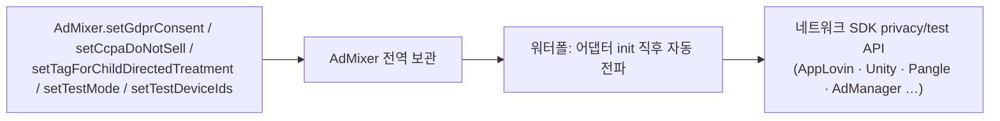

# 개인정보 동의 및 테스트 설정

이 페이지에서는 GDPR/CCPA/COPPA 등 **개인정보 동의값**과 **테스트 모드/테스트 디바이스** 설정을 안내합니다.

> ℹ️ 이 설정들은 **선택 사항**이며, QA·심사·프라이버시 규제 대응 시 사용합니다. 설정하지 않으면 SDK는 해당 항목을 하위 네트워크에 적용하지 않습니다(미설정 유지).

---

## 동작 방식

`AdMixer`에 전역으로 1회 설정하면, 워터폴에서 각 광고가 로드될 때 SDK가 **각 미디에이션 네트워크의 privacy/test API로 자동 전파**합니다. 동의 수집(CMP) UI는 매체/CMP의 책임이며, 본 API는 **수집된 값의 전파**만 담당합니다.



---

## 개인정보 동의 (Privacy / Consent)

`Application.onCreate()` 또는 동의 수집 직후에 설정하세요.

#### Java
```java
// GDPR 사용자 동의 여부 (EU 대상)
AdMixer.setGdprConsent(true);

// CCPA "Do Not Sell" 플래그 (US 대상)
AdMixer.setCcpaDoNotSell(false);

// CCPA US Privacy 문자열 (IAB CMP 연동 시)
AdMixer.setUsPrivacy("1YNN");

// COPPA(아동 대상) 여부
AdMixer.setTagForChildDirectedTreatment(AdMixer.AX_TAG_FOR_CHILD_DIRECTED_TREATMENT_TRUE);  // 아동 대상
AdMixer.setTagForChildDirectedTreatment(AdMixer.AX_TAG_FOR_CHILD_DIRECTED_TREATMENT_FALSE); // 일반 대상
```

#### Kotlin
```kotlin
AdMixer.setGdprConsent(true)
AdMixer.setCcpaDoNotSell(false)
AdMixer.setUsPrivacy("1YNN")
AdMixer.setTagForChildDirectedTreatment(AdMixer.AX_TAG_FOR_CHILD_DIRECTED_TREATMENT_TRUE)
```

### 네트워크별 전파 매핑

| 네트워크 | GDPR | CCPA | COPPA |
|---|---|---|---|
| **AppLovin** | `setHasUserConsent` | `setDoNotSell` | 미지원(13.x에서 연령 API 제거) |
| **Unity Ads** | MetaData `gdpr.consent` | MetaData `privacy.consent`(= !doNotSell) | MetaData `user.nonbehavioral` |
| **Pangle** | `setGDPRConsent` | `setPAConsent` | 미지원(번들 7.7.0.2 API 부재) |
| **Google AdManager** | UMP(별도 동의 흐름) | UMP(별도) | `RequestConfiguration.setTagForChildDirectedTreatment` |
| Teads / Adfit / Mobwith / Naver | TCF 자동/제한적 | 제한적 | 제한적 |

> ⚠️ 미설정 항목은 해당 네트워크에 적용하지 않습니다. 일부 네트워크는 공식 SDK가 해당 privacy API를 제공하지 않아 전파되지 않을 수 있습니다(표의 "미지원" 참고).

---

## 테스트 모드 / 테스트 디바이스

QA·심사 단계에서 테스트 광고를 받으려면 테스트 모드와 테스트 디바이스 광고 ID를 설정하세요.

#### Java
```java
// 전역 테스트 모드
AdMixer.setTestMode(true);

// 테스트 디바이스 광고 ID(GAID) 목록
AdMixer.setTestDeviceIds(Arrays.asList("AAAAAAAA-BBBB-CCCC-DDDD-EEEEEEEEEEEE"));
```

#### Kotlin
```kotlin
AdMixer.setTestMode(true)
AdMixer.setTestDeviceIds(listOf("AAAAAAAA-BBBB-CCCC-DDDD-EEEEEEEEEEEE"))
```

### 네트워크별 테스트 적용

| 네트워크 | 테스트 적용 |
|---|---|
| **AppLovin** | 초기화 시 `setTestDeviceAdvertisingIds(testDeviceIds)` |
| **Unity Ads** | `UnityAds.initialize(..., testMode)` 인자에 반영 |
| **Pangle** | `PAGConfig.debugLog(testMode)` (테스트 디바이스는 Pangle 대시보드에서 GAID 등록) |
| **Google AdManager** | `RequestConfiguration.setTestDeviceIds(testDeviceIds)` |

> ℹ️ 테스트 디바이스 광고 ID(GAID)는 LogCat에서 각 네트워크 SDK가 출력하는 안내 메시지로 확인하거나, 기기 설정 > Google > 광고에서 확인할 수 있습니다.

---

## 네트워크별 키 주입 (setAdapterConfig)

서버 설정(media-conf)에 특정 네트워크 키가 내려오지 않는 경우, 매체가 `AdInfo.Builder.setAdapterConfig()`로 직접 주입할 수 있습니다. 서버 값이 우선이며, **서버에 없는 키만** 클라이언트 값으로 채워집니다(Server-Precedence).

```java
// 예: AppLovin SDK Key를 직접 주입
Map<String, String> applovinConfig = new HashMap<>();
applovinConfig.put("sdkKey", "YOUR_APPLOVIN_SDK_KEY");

AdInfo adInfo = new AdInfo.Builder(ADUNIT_ID)
    .setAdapterConfig(AdMixer.ADAPTER_APPLOVIN, applovinConfig)
    .build();
```

| 네트워크 | adapterName 상수 | 키 예시 |
|---|---|---|
| Pangle | `AdMixer.ADAPTER_PANGLE` (`"Pangle"`) | `app_id`, `placement_id` |
| AppLovin | `AdMixer.ADAPTER_APPLOVIN` (`"AppLovin"`) | `zone_id`, `sdkKey` |

> ℹ️ 일반적으로 네트워크 키는 nap ssp 서버(media-conf)가 공급합니다. `setAdapterConfig`는 서버 미제공 상황의 보완 수단입니다.

---

## 문의

개인정보/테스트 설정 관련 문의는 **nap_mx@nasmedia.co.kr**로 연락해 주세요.
